# Portfolio T1A2

**Link to published portfolio website: www.michelleoha.com**
**Please refer to this link if above has not deployed yet: https://tiny-haupia-f8994b.netlify.app**

**Link to GitHub repo: https://github.com/MichelleOha/MichelleOha.github.io**

My portfolio website is bright and creative with a minimalist feel to it so that it gets straight to the point for the user. It's purpose is to tell the user who I am and what I do and allow them to contact me with minimal effort.

My target audience is software companies and their HR departments or companies looking for a web developer with a creative flare. The user can see I have potential with my creative nature and am able to use HTML and CSS.

I researched and found many different styles of web development portfolios online and was drawn to the more simplistic, clean, bright, creative portfolios. Images or photos of people on the home page introducing themselves seemed the most logic way to go about it for me.

_Colour Palette:_

I originally wanted to go with really safe neutral colours like white, tan, beige. But once I started to style with these colours I didn't feel inspired by them. So I did some research and found a colour palette that made me feel creative and captivated me and I decided I would work with something similar to that (inspiration image below)

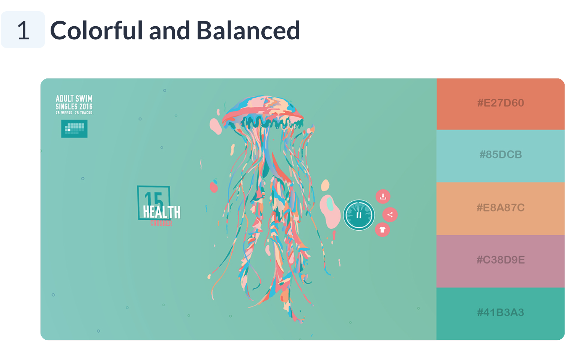
Image reference: https://visme.co/blog/website-color-schemes/

_My final colour palette:_

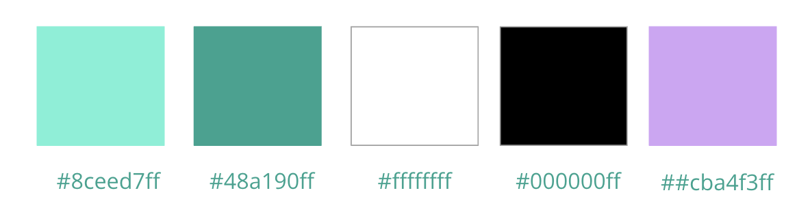

_Representing my artist talents:_

I wanted to add an element to my portfolio to represent my creative talents. I decided to draw some original sketches in paint that I would use on my pages that were relevant to the content. I found this to be really enjoyable and a good way to express my creativity to the user.

**Sketches created and used in my portfolio:**

_Sketch of me at a computer coding_

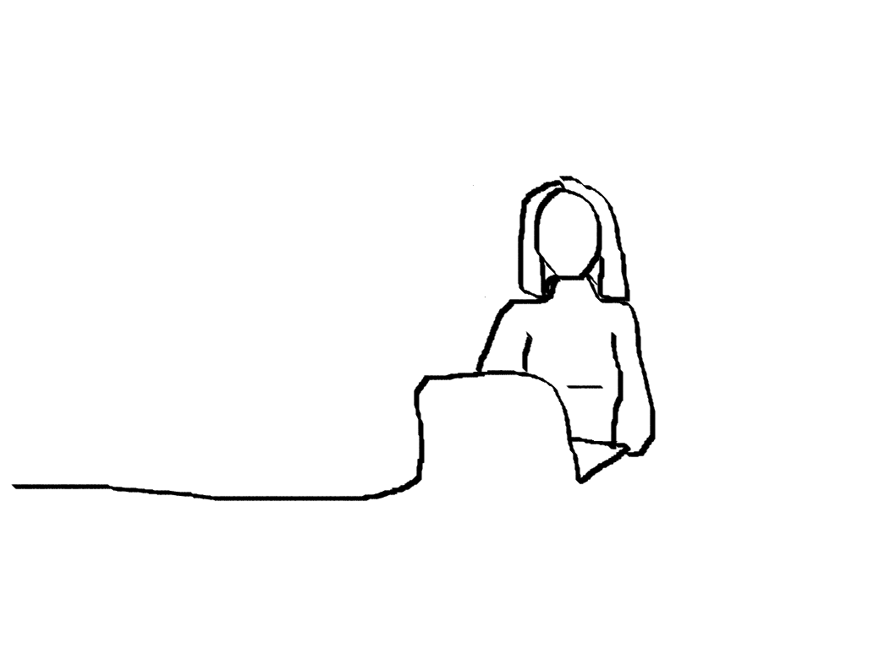

_Sketch of my career path so far -fashion designer, bookkeeper, and soon to be web developer_

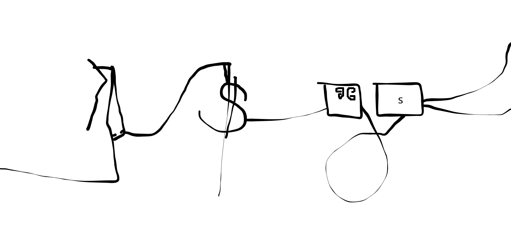

_Sketch of my location "KIAMA BLOWHOLE"_

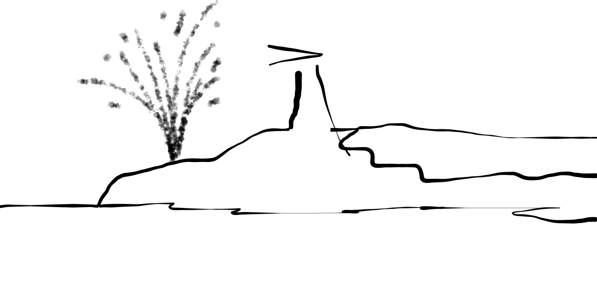

_Extra features to also target dyslexic users:_

As a dyslexic person, I wanted to use that to my advantage when it came to the visual side of my portfolio, including the layout and overall execution of my website. I wanted a font that was easy to read so I chose Open Sans. I wanted there to be minimal text used on my pages so that the user could see what message I was trying to portray without having to search for it. I wanted everything centered where possible and the menu bar to be clear and easy to read and access.

**Sitemap**

.png>)

I decided to have my portfolio layout across all device sizes the same so that it is easily recognises by the users. This is something I find a little distracting and sometimes confusing myself when I go from an IPhone to a desktop screen.

**Wireframes created in Figma**

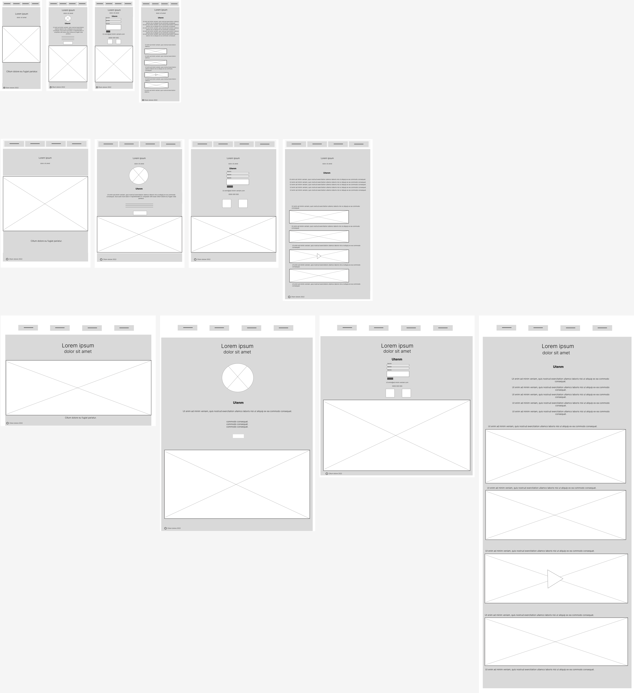

**Styling in CSS vs SASS**

I changed from CSS to SASS before deciding to do some more research into it and found I could use variables to achieve what I wanted in CSS styling in regards to repeat colours and font-sizes. This way I could focus on developing my skills even further in CSS styling.

_Devtools_ was extremely helpful when it came to altering my styling in CSS. Designing and completing the IPhone screen size first was a great help. All I then needed to do was to add media break points for the IPad and desktop screen sizes.

**Overall design and layout of portfolio**

_Home Page_

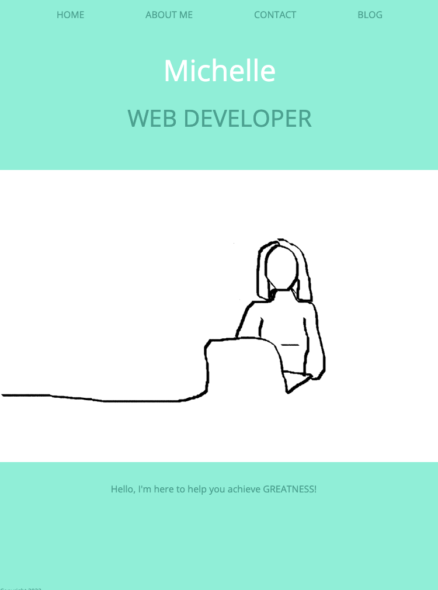

Clean and simplistic design with my name, job title and a unique original sketch that captures the users eye.

_About Me Page_

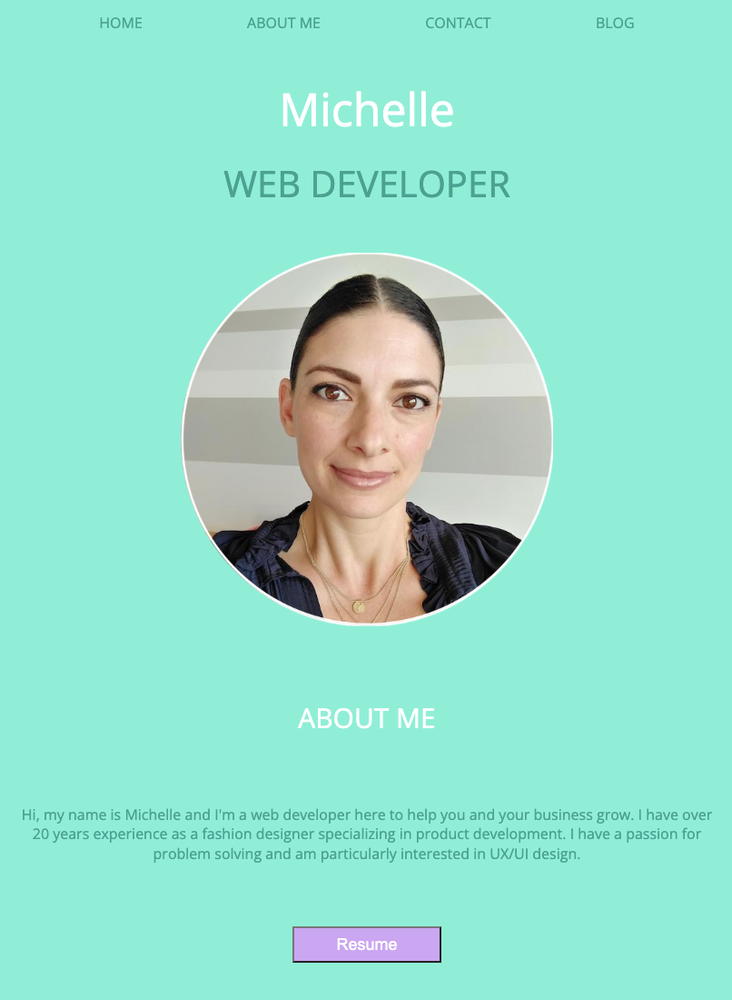

I have included a photo of myself so that the user recognises who I am as it is the same photo I have used in my linkedin profile. I have given a brief paragraph on my experience. I have a resume button in lavender encouraging the user to click on it which will then open a PDF of a mock resume for them to access and read. Under that I have listed my tertiary qualifications and an original sketch at the bottom of the page.

_Contact Page_

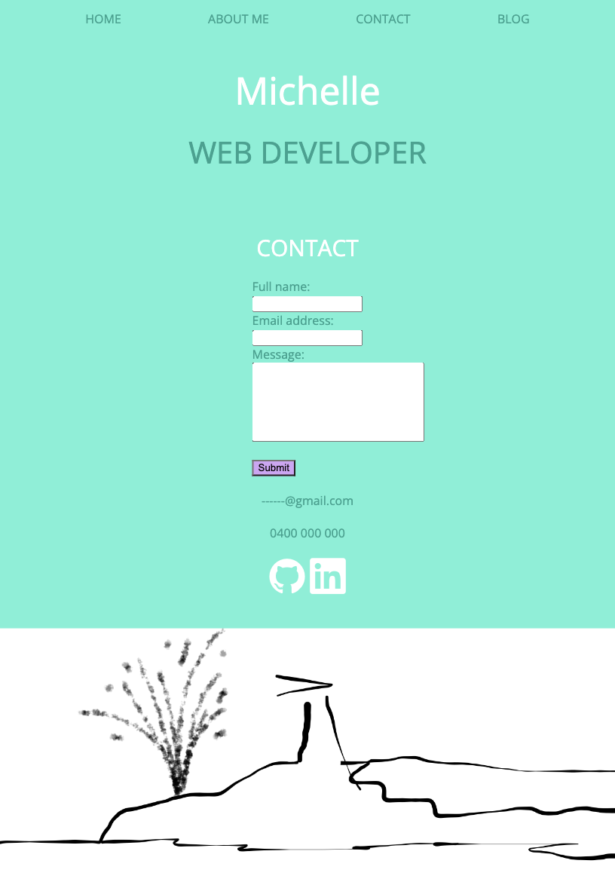

_Amended Contact Form to Center it in the Page_

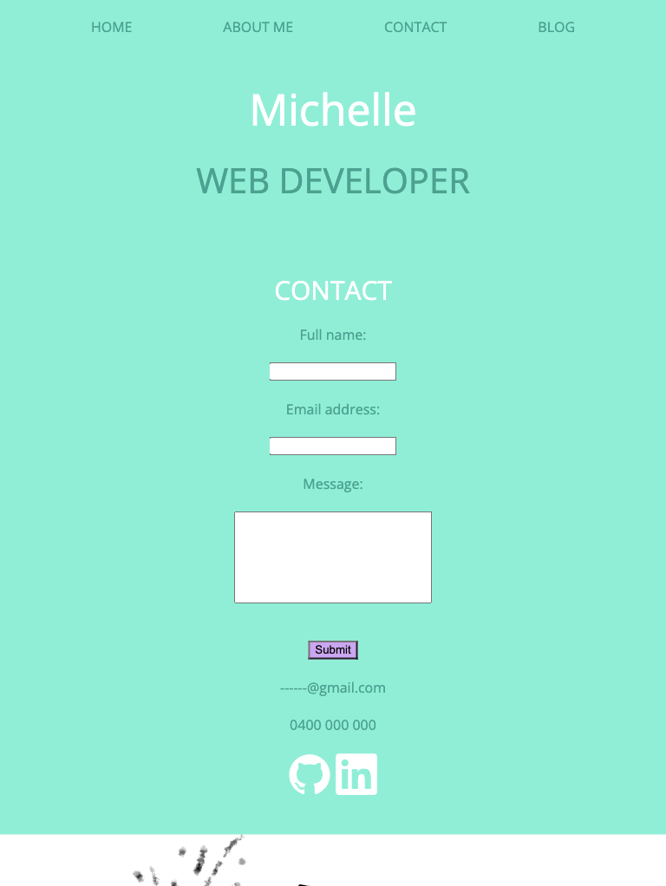

I have created a contact form so that there is minimal effort on the users behalf to have to engage and contact me. I have used lavender for the submit button so it is clearly visible to the user. At the bottom of the page I have inserted another original sketch of my location.

_Top of the Blog Page_

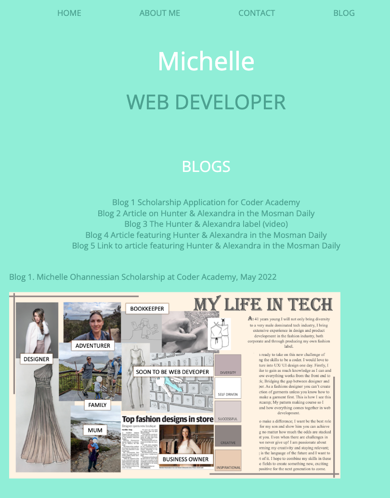

The user can select one of the blogs from the list at the top of the page (under the Blogs heading) which has a link directing them start to that particular blog on the same page.

**My Tech Stack**

Figma to create wireframes

Draw.io for sitemap

VSCode (HTML and CSS and README.md)

Devtools - to adjust and make changes to CSS

Devicon website - icons

Terminal - Git

GitHub - to save and merge the changes to my branches

Netlify - to deploy my website

Google domain names (URL) - michelleoha.com

Google Slides for slideshow presentation
